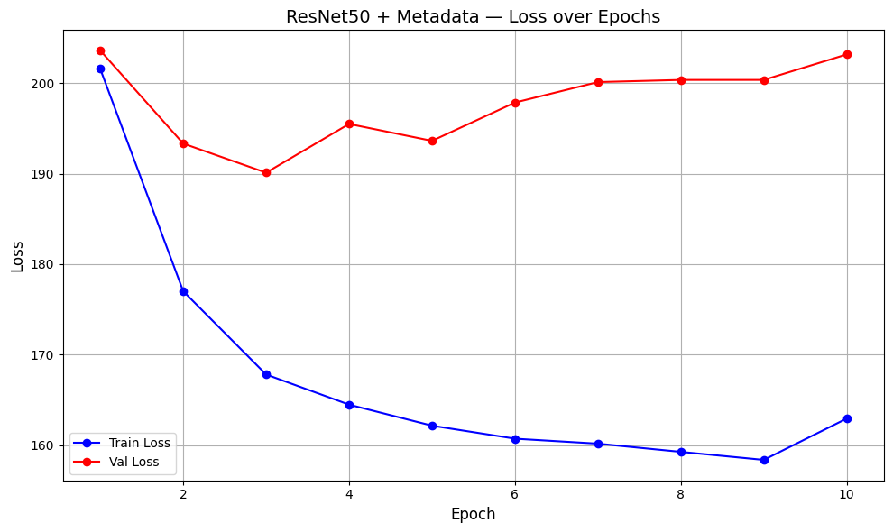

# PlantTraits2024: Predicting Plant Traits from Images

## Overview
This project aims to predict six key plant traits using a multi-modal approach combining plant images and environmental metadata. By leveraging deep learning techniques (ResNet-50, EfficientNetV2, and Vision Transformers) within a multi-task learning framework, we simultaneously predict multiple traits to better understand plant adaptation to climate change, temperature fluctuations, and water scarcity.

This repository contains the code and documentation for our submission to the [PlantTraits2024 Kaggle Competition](https://www.kaggle.com/competitions/planttraits2024).

## Predicted Traits
The models predict the following six continuous plant traits:
1. **X4**: Stem/Wood Density
2. **X11**: Leaf Area per Leaf Dry Mass
3. **X18**: Plant Height
4. **X26**: Seed Dry Mass
5. **X50**: Leaf Nitrogen Content per Leaf Area
6. **X3112**: Leaf Area

## Dataset
- **Images**: ~55,000 plant images sourced from the iNaturalist database.
- **Metadata**: 169 ancillary predictors (e.g., climatic and soil variables like temperature, precipitation, and soil nutrients) from the TRY database.

## Methodology
Our approach utilizes multi-task learning to predict all six traits simultaneously. The models take two inputs:
1. **Image Input**: Resized to 224x224 pixels and processed through a CNN/ViT backbone.
2. **Metadata Input**: 169-dimensional vector processed through a Multilayer Perceptron (MLP).

The features from both branches are concatenated and passed through final dense layers to output the predicted trait distributions (means and standard deviations).

### Models Implemented
- **ResNet-50**: Uses a deep residual network backbone to extract 2048-dimensional image features. Achieved the best performance by capturing complex relationships.
- **EfficientNetV2**: Uses a pre-trained EfficientNetV2 backbone. A custom $R^2$-based loss function was used to optimize the main and auxiliary outputs.
- **Vision Transformer (ViT)**: Uses the `ViT_base_patch16_224` architecture pre-trained on ImageNet. Explored for its self-attention mechanism, though it struggled with stability on the limited dataset.

## Results
The models were evaluated using $R^2$ (coefficient of determination), Mean Squared Error (MSE), and Mean Absolute Error (MAE).

| Model | Validation $R^2$ | Validation MSE |
|-------|------------------|----------------|
| **ResNet-50** | **0.1303** | 1,097,735 |
| **EfficientNetV2** | 0.0463 | 77,210 |
| **ViT** | -0.22 | 949,781 |

*Note: ResNet-50 outperformed the baseline and other models in capturing the variance ($R^2$) of the plant traits, which is the primary metric for this competition.*

## Project Structure
- `ResNet50_V2_test.ipynb`: Jupyter notebook for the ResNet-50 model implementation and testing.
- `ResNet50_V3_without_test.ipynb`: Jupyter notebook for the ResNet-50 model training without the test set.
- `EfficientNetV2_model.ipynb`: Jupyter notebook for the EfficientNetV2 model implementation.
- `ML4CC_Project_Report.pdf`: Comprehensive project report detailing the background, methods, results, and discussion.
- `ML4CC Project Proposal.docx`: Initial project proposal.
- `my_new_submission.csv`: Sample submission file generated by the models.

## Future Work
- **Incorporate High-Resolution Metadata**: Integrate high-resolution soil maps and satellite-derived indices (surface temperature, canopy moisture).
- **Refine Architecture**: Explore hybrid ConvNet-attention blocks to fuse local feature extraction with global context modules.
- **Transfer Learning**: Fine-tune the model on previously unseen plant species to test generalization.
- **Image Segmentation**: Implement pre-segmentation (e.g., U-Net or DeepLabV3) to separate the plant from the background and reduce noise.

## Contributors
- **Salam Haroun**: Presentation outline, Background, Abstract, Methods, Results
- **Anvi Parikh**: Pre-processing code, Discussion, Presentation outline
- **Aidan Fasano**: ViT model implementation, Findings, ViT results
- **Tiffany He**: EfficientNetV2 model implementation and results
- **Yuanzou Gao**: ResNet-50 model implementation and results
